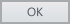
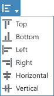
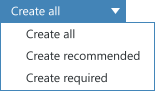
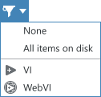

## Command buttons
**Codename:** `ShellButton` - NationalInstruments.Controls.Shell

| State         | Image         | 
| ------------- |:-------------:| 
| Normal        |         | 
| Default       | | 
| Hover         |          |  
| Mouse Down    |     |
| Disabled      |       |

**XAML Code Snippet**

<shell:ShellButton 
    Content="OK"
    Click="onClick" 
    Height="24" 
    MinWidth="70"
    Padding="10,0,10,1" />


## Toolbar buttons

**Codename:** `ShellToolBarButton` - NationalInstruments.Shell

| State         | Image         | 
| ------------- |:-------------:| 
| Normal        |         | 
| Hover         |          |  
| Mouse Down    |     |

## Toolbar dropdown button
A menu for a small set of related commands. The text on the button doesn't change based on the dropdown selection.

**Codename:** `ShellDropDownButton` - National.Instruments.Controls.Shell

| State         | Image         | 
| ------------- |:--------------| 
| Normal        |         | 
| Hover         |          |  
| Active    |     |

## Split buttons

**Codename:** `ShellSplitButton`

Two separate hover states.  The left or top side should function like a command and the right or bottom side will open a drop-down list where a variation of the command is listed. This button is appropriate when there is a "dominant" command but we want to provide related, but less-often-used additional
commands.

| State                 | Image        | 
| --------------------- |:-------------| 
| Normal                |         | 
| Hover (Button)        |          |  
| Hover (Dropdown)      |          |  
| Mouse Down (Button)   |     |
| Mouse Down (Dropdown) |     |

## Split toggle buttons
**Codename:** `ShellSplitToggleButton`

Used in file pane for toggling/selecting filter

| State         | Image         | 
| ------------- |---------------| 
| Normal        |         | 
| Hover (Button)         |          |  
| Hover (Dropdown)         |          |  
| Mouse Down (Dropdown)    |     |

## Toggle buttons

**Codename:** `ShellToggleButton`

| State         | Image         | 
| ------------- |:-------------:| 
| Normal        |         | 
| Hover         |          |  
| Active         |          |  
| Active (Hover)    |     |

