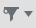

Buttons are used for executing action in the product. They should convey what will happen when the user clicks on them.

## Command buttons
**Codename:** `ShellButton` - NationalInstruments.Controls.Shell 

The command button is one of the most well known and ubiquitous types of buttons. They are used in dialogs, the configuration pane and other general areas of the UI.

#### State examples

| State         | Image         |
| ------------- |:-------------:|
| Normal        |         |
| Default       | |
| Hover         |          |
| Mouse Down    |     |
| Disabled      |       |

**XAML Code Snippet**

<shell:ShellButton 
    Content="OK"
    Click="onClick" 
    Height="24" 
    MinWidth="70"
    Padding="10,0,10,1" />


## Split buttons

**Codename:** `ShellSplitButton` - NationalInstruments.Controls.Shell

A split button provide a primary command and access to secondary commands via a dropdown. The left or top side should function like a command and the right or bottom side will open a dropdown list where a variation of the command is listed. This type button is appropriate when there is a dominant command but you need to provide related, but less-often-used additional commands.

| State                 | Image        |
| --------------------- |:-------------|
| Normal                |            |
| Hover (Button)        |        |
| Hover (Dropdown)      |    |
| Mouse Down (Button)   |   |
| Mouse Down (Dropdown) |   |

## Toolbar command buttons
This is used in the same way as the normal command button but is used in a toolbar. Typically, this button will use an icon as its content instead of text.

**Codename:** `ShellToolBarButton` - NationalInstruments.Shell

| State         | Image         | 
| ------------- |:-------------:| 
| Normal        |         |
| Hover         |          |
| Mouse Down    |     |

## Toolbar toggle buttons

**Codename:** `ShellToggleButton` - NationalInstruments.Controls.Shell

Toogle buttons are used to turn something on or off. The current state is communicated through the button.

| State       | Image         |
| ----------- |:-------------:|
| Off         |         |
| Off (Hover) |   |
| On          |         |
| On (Hover)  |   |

## Toolbar split toggle buttons

**Codename:** `ShellSplitToggleButton` - NationalInstruments.Controls.Shell

The split toggle button is similar to the split button
Used in file pane for toggling/selecting filter

| State                  | Image         |
| ---------------------- |---------------|
| Normal                 |               |
| Hover (Button)         |           |
| Hover (Dropdown)       |       |
| Mouse Down (Dropdown)  |   |

## Toolbar dropdown button

A menu for a small set of related commands. The text on the button doesn't change based on the dropdown selection.

**Codename:** `ShellDropDownButton`

| State         | Image         | 
| ------------- |:--------------| 
| Normal        |     |
| Hover         |      |
| Active        |     |