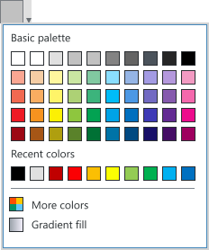

**Codename:** `ShellColorBox` - NationalInstruments.Controls.Shell

| State              | Image         |
| ------------------ |:--------------|
| Normal             |  |
| Active             |  |
