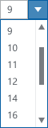

A combo box is a combination of a dropdown list and an editable text box, thus allowing users to enter a value that isn't in the list. Arbitrary values means the user can enter any value. Fixed values means the user cannot enter values not in the list.  The control will coerce or revert to the previously entered value.

**Codename:** `ShellComboBox`   - NationalInstruments.Controls.Shell  
**Codename:** `ShellComboBoxItem` - NationalInstruments.Controls.Shell

| State              | Image         |
| ------------------ |:-------------:|
| Normal             |          |
| Textbox (Hover)    |   |
| Dropdown (Hover)   |  |
| Dropdown (Active)  | |

#### Mixed state
If the user has selected objects with different values, this control will be blank to represent a mixed state.