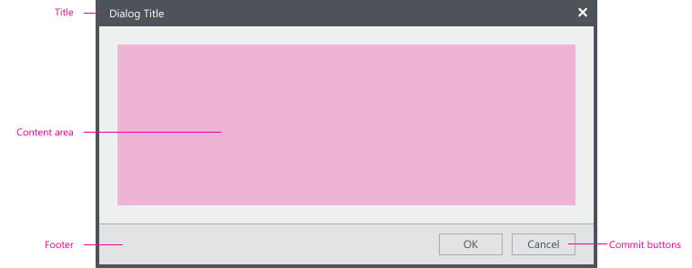
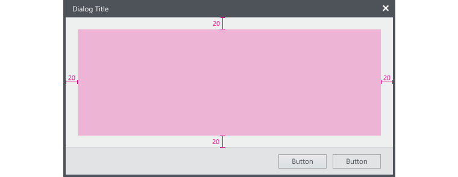
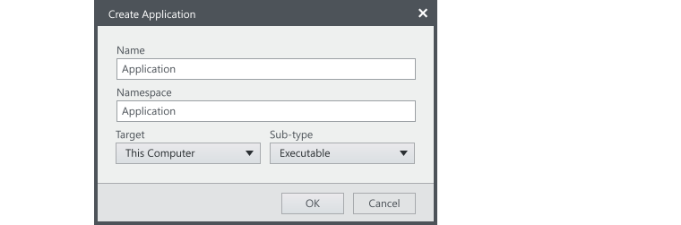
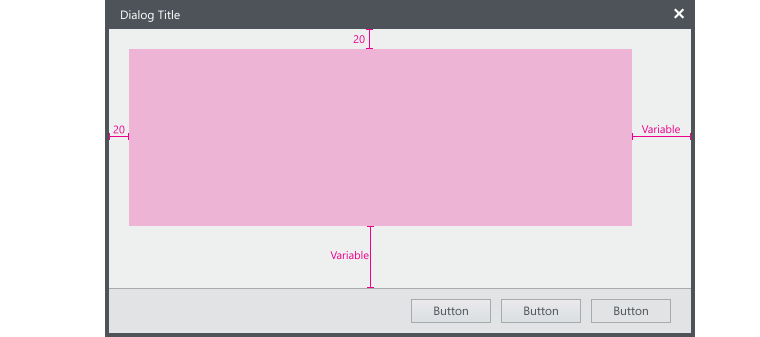
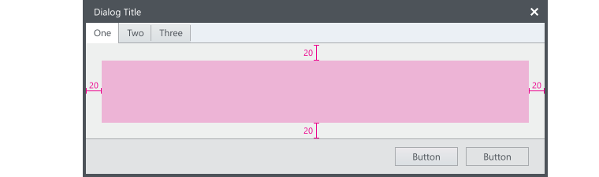
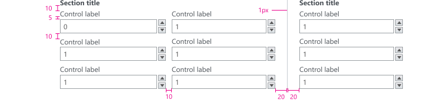
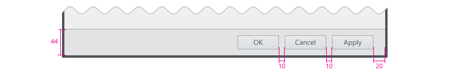
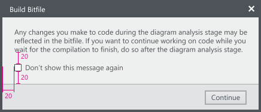

## Layout

This section provides information on layout specifications for dialogs.
Dialogs typically contain the following areas:

- Title
- Content area for instructional text
- Footer for providing commit buttons

 

## Content Area

#### Single page dialog

The content area of a single page dialog should have uniform padding of 20px.

**Single page dialog example**

#### Multiple page dialog

For multiple page dialogs, the top and left padding should stay consistent at 20px. The right and bottom padding will vary between pages but the page with the largest content area should have 20px padding.
The dialog should not change size between pages.

#### Tabbed dialog

The tabs within a tabbed dialog will be flush against the window frame but the content of each tab should use the standard padding. The dialog should be as large as the tab with the most content. The dialog should not change size between tabs.

## Content controls & text

#### Control Spacing

#### Text spacing

Text is measured from the baseline of one line to the top of the capital letter on the next line.

## Footer

#### Control spacing

**XAML code snippet**

This is a snippet of code for creating a footer in a dialog.


<Grid Background="{StaticResource NIWhiteBlueBrush}">
    <Grid.RowDefinitions>
        <RowDefinition Height="Auto"/>
        <RowDefinition/>
    </Grid.RowDefinitions>
	<!—This is the main content section—>

    <!—End main content section—>

    <!--This is the footer section-->
    <Border Background="{StaticResource NIBackgroundBrush}"  BorderBrush="{StaticResource NIGrayNeutral68Brush}" BorderThickness="0,1,0,0" Height="45" VerticalAlignment="Bottom" Grid.Row="1">
        <StackPanel Orientation="Horizontal" VerticalAlignment="Stretch" Margin="20,0,10,0" HorizontalAlignment="Right">
            <StackPanel.Resources>
                
            </StackPanel.Resources>
            <shell:ShellButton Content="Fake button" Height="24" MinWidth="70" Padding="10,0,10,1" />
            <shell:ShellButton Content="Close" Height="24" MinWidth="70" IsCancel="True" Padding="10,0,10,1" />
        </StackPanel>
    </Border>
<!--End footer section-->
</Grid>


**Don't show this (item) again**
Provide this option to allow the user to ignore a recurring dialog box only when it is the only option. Try to eliminate the need for the dialog, if possible.
Set the value to `false` by default.

## Commit buttons

#### Selecting which commit button to use

| Label                 | When to use        | 
| --------------------- |-------------| 
| OK                    | Applies the changes or commits the task and closes the dialog. Don't use for error messages (errors are never OK). Instead, use Close. If a dialog performs a specific task, use a specific label convention [Do it/Don't do it] instead. Don't use to respond to questions.    | 
| Apply                 | Applies the pending changes but leaves the dialog open.          |  
| Yes/No                | Response to Yes⁄No questions. Must always be in a pair. If phrasing a specific response is long or awkward. Don't use if the meaning of No is unclear.    |
| [Do it]⁄[Don't Do it] |  When you can provide specific button labels. |
| Cancel                |  Discards all changes, reverts to the previous state with no side effect, and closes the window. When all pending changes or actions can be discarded and side effects undone. Don't use if the meaning on Cancel is unclear. |
| Close                 |  Closes the window without discarding changes and side effects. When users can’t make changes, such as informational dialogs. |
| Stop                  | Stops a currently running task and closes the window. When work in progress can't be discarded. Typically used with progress bars.  |

#### Order of commit buttons

For Windows OS, the order of the commit buttons are:

1. OK⁄[Do it]⁄Yes
1. [Don't Do it]⁄No
1. Cancel⁄Close
1. Apply (if present)

#### Using Help commit buttons
Do not use generic Help buttons, if possible. Strive to give user contextual content when/where they need it instead of using a generic Help button. Put the Help button last if it is unavoidable.

#### When to confirm commit buttons

Generally, commit confirmations are unnecessary and annoying. But confirming a commit may be appropriate if the action is potentially catastrophic and/or might result in a significant loss of user data, time, or effort.

#### Miscellaneous

Close button on the title bar must have the same effect as clicking Cancel or Close.Don't include instructions in the text, such as “Press OK to continue”, or “Cancel to stay on the current page”. Instead, use specific commit button labels or change the text.
