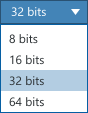

A dropdown is a list in which the current value is displayed in the element. Upon clicking on the element, the other options are visible. The user cannot manually enter values.

If the user needs to manually enter values, use a [combo box](../combo-boxes/)

**Codename:** `ShellComboBox`  - NationalInstruments.Controls.Shell  
**Codename:** `ShellComboBoxItem` - NationalInstruments.Controls.Shell

Set `IsEditable=false` to disable typing in the control.

## Standard dropdowns

| State         | Image         |
| ------------- |:-------------:|
| Normal        |         |
| Hover         |          |
| Active        |         |

#### Mixed state
If the user has selected objects with different values, this control will be blank to represent a mixed state.

#### Dynamic dropdowns
In some situations, dropdown lists are populated dynamically and may have 1 or multiple options depending on the situation. In these cases, if the dynamic dropdown only has one option available at a given time, disable the control. If it has multiple options available, enable the control.

If the dropdown **always** has 1 item in it, consider a different control like a [text block](.../text-blocks/). 