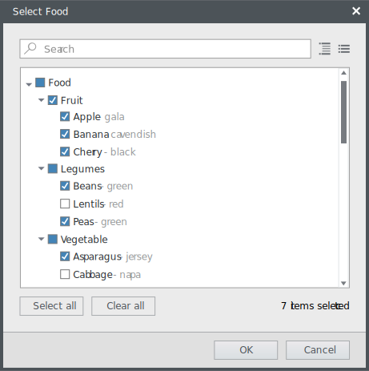
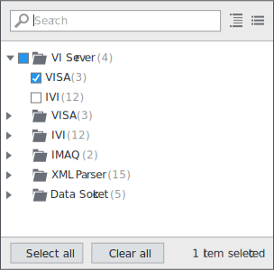
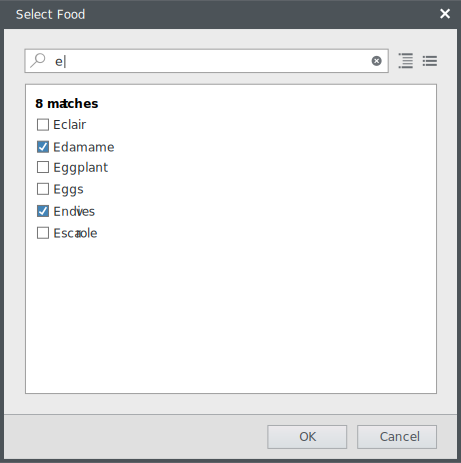
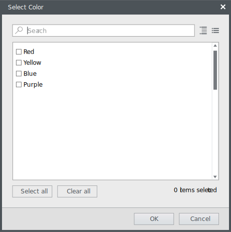
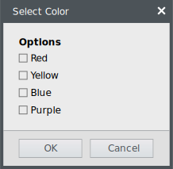
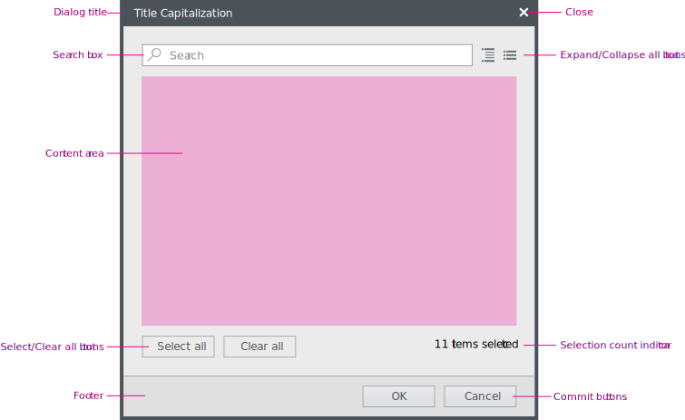
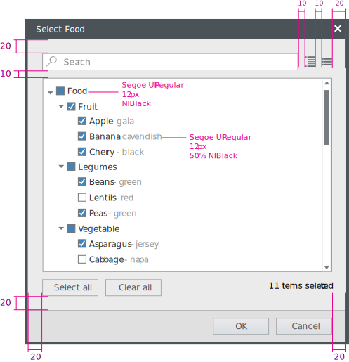

**Codename:** `FilteredTreeView` - NationalInstruments.Controls.Shell 

The filtered tree view (FTV) control allows users to search and browse a deep hierarchy of items and make selections. The FTV provides options for single or multiple selections. It can be displayed in dialogs as well as flyout menus.

## General usage
Use the FTV if you need to display and allow users to browse and search a hierarchy of more than 2 levels, not including the root node.

If the user needs different sorting options of the data set (e.g. alphabetically, file type, date), use a list view control.

## Usage examples

When deciding between the FTV and another control, consider this question: 
Is the hierarchical data set large enough to require a search mechanism? If so, use the FTV.

Example of FTV providing multiple selections in a modal dialog.

  

Do

Example of FTV providing multiple selections in a flyout.

  

Do

Example of FTV in search mode.

  

Do

If the items have no hierarchy and the data set is small, do not use the FTV.

  

Don't

Instead use a different way of providing the options to the user.

  

Do

 
## Layout and spacing

 

 

