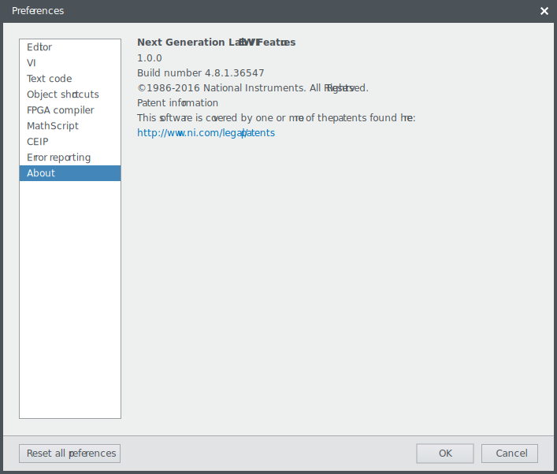
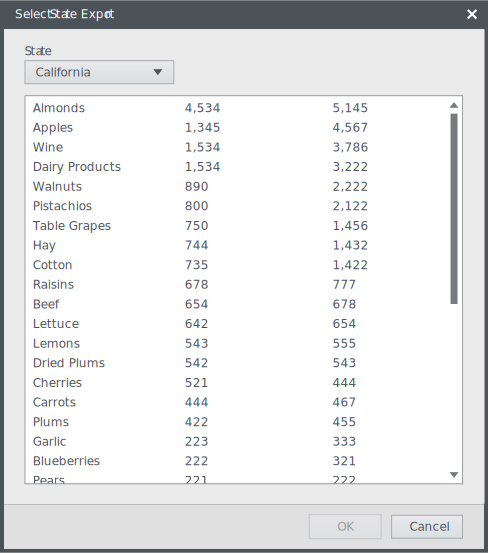
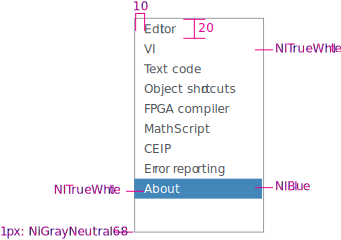

**Codename:** `ListView` - NationalInstruments.Controls.Shell

List views vertically display data in scrollable columns.

## General usage
List views are used to show a list of items for selection which represent a command, object, or attribute. 

## Usage examples

Example of a list view providing multiple selectionable options in a modal dialog.

  

Do

If the data set you intend to display requires multiple columns per row and would benefit from column headers and the ability to sort, consider a [Table](../tables/) instead.

  

Don't

## Layout spacing and color

 

**XAML Code Snippet**

This is a snippet of code from the Preferences Pane with the layout-related properties left out.


<shellControls:ListView
        ItemContainerStyle="{DynamicResource ThemedListBoxItemStyle}" 
        ItemsSource="{Binding Path=PageNames}"> 
    <shellControls:ListView.ItemTemplate> 
        <DataTemplate> 
            <TextBlock Text="{Binding}"/> 
        </DataTemplate> 
    </shellControls:ListView.ItemTemplate> 
</shellControls:ListView> 
