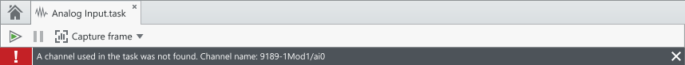
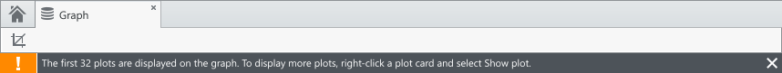
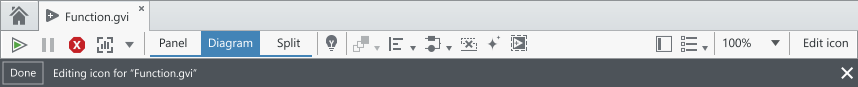
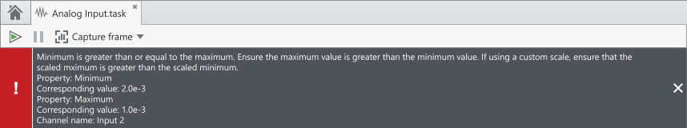

Notifications are used to provide feedback brief system messages to the users from the system. They can be used to communicate explicit actions from the user or implicit things that have happened due to a change in the system.

## Document notifications

**Codename:** `DocumentHeaderControl` - NationalInstruments.Design

Document notification are displayed within the space of a document. Only one notification should be displayed at a time. Every aspect of a document, such as panel and diagram for LabVIEW VIs, already contains a placeholder `DocumentHeaderControl` to display document notifications.

## Examples
#### Error notification

#### Warning

#### Mode

#### Multiline

 