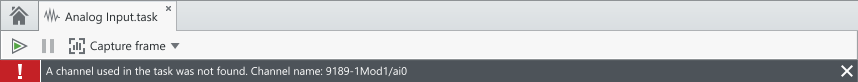
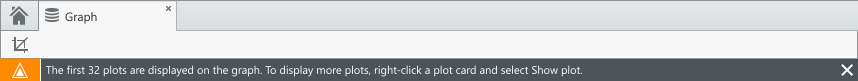
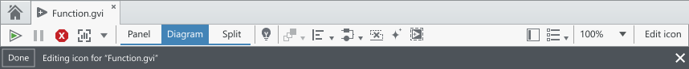
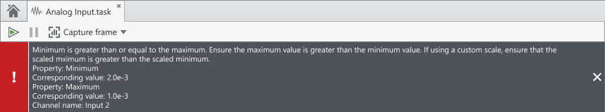
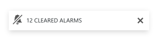
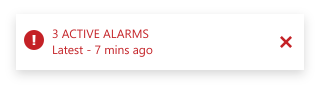
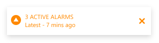
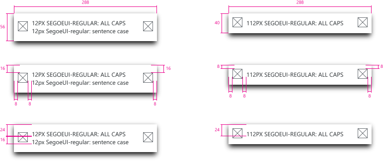

Notifications are used to provide feedback brief system messages to the users from the system. They can be used to communicate explicit actions from the user or implicit things that have happened due to a change in the system. Notifications consist of a message, a method of dismissal, and optional icons.

## Document notifications

**Codename:** `DocumentHeaderControl` - NationalInstruments.Design

Document notification are displayed within the space of a document. Only one notification should be displayed at a time. Every aspect of a document, such as panel and diagram for LabVIEW VIs, already contains a placeholder `DocumentHeaderControl` to display document notifications.

### Examples
#### Error notification

#### Warning

#### Mode

#### Multiline

 

## Toast notifications

**Codename:** `ToastNotification` – NationalInstruments.Shell
A toast notification is a small popup used to display brief windows of important information to the user. Toasts are non-modal and do not prevent the user from viewing and interacting with their current window. Typically, toasts disappear automatically after a timeout but they can also persist, much like alarms toasts in FlexLogger. While document header notifications are typically scoped within the context of the document, toasts can be used to display system information.

### Behavior

Toast notifications animate into the top-right corner of the application window by entering from the top. New toasts will replace previous toasts by pushing them down. Toasts follow the app window corner unless the window is minimized, in which case the toasts go to the corner of the monitor.

### Usage Examples

**Alarm Toasts in FlexLogger** 
During the alarm configuration process in FlexLogger, the user specifies critical and warning conditions. When the test is running, the alarms will be triggered based on the user’s defined thresholds. In FlexLogger, alarm toasts do not time out and clicking on the toast navigates the user to the Alarm History Pane.

 

 

 

### Layout
 