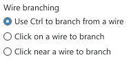

Use radio buttons to choose one option from a set of mutually exclusive choices.

**Codename:** `ShellRadioButton` - NationalInstruments.Controls.Shell
**Codename:** `ShellRadioButtonGroup` - NationalInstruments.Controls.Shell

## When to use

* Use radio buttons when you want to emphasize all options equally. If the default option is recommended for most users in most situations, consider using a drop-down list. 
* Always have one radio button selected by default. Use the most likely or safest (to prevent data loss) option. 
  * Exception: 
    * There is no acceptable default and the user must make an explicit choice. 
    * UI must reflect the current state and the option hasn’t been set yet. In this case, a default value would incorrectly communicate to the user that they don’t need to make a selection. 
    * A group of radio buttons representing a property in a mixed state, which happens when a property for multiple objects doesn’t have the same setting. 
* Don’t use the selection of radio buttons to: 
  * Perform a command. 
  * Display other windows, such as a dialog box. 
  * Dynamically display other controls related to the selected control.  
* If none of the options is a valid choice, add another radio button to reflect the choice, such as “None”. 
* Align radio buttons vertically instead of horizontally to increase readability and aid localization. 
* Users often expect the first option to be the default, but that might not be appropriate in every case. Consider rewording option labels, if necessary.

## Individual labels 
* Every radio button must contain a label. 
  * Write the label as a phrase with no ending punctuation rather than a complete sentence. 
* Use parallel phrasing. Focus the label text on the differences among the options. 
* Use positive phrasing. For example, use “do” instead of “do not”, and “print” instead of “do not print”. 
* If all options have the same introductory text, move the introductory text to the group label. 
* Keep the actual radio button labels brief. If the option requires further explanation, provide secondary text below the radio button. Use complete sentences and ending punctuation. Adding an explanation to one radio button doesn’t mean you have to add an explanation for all radio buttons. 
* Clicking the radio button label selects the radio button. 

| State         | Image         | 
| ------------- |:-------------:| 
| Selected        |         | 
| Selected (Hover)         |          | 
| Unselected        |         | 
| Unselected (Hover)         |          |   
| Disabled      |     |

## Grouping 
* Keep the number of options in a radio button group between two and seven. If you have more than eight options, use a drop-down list. 
* List radio button options in a logical order. Common ways to logically order radio buttons are from most likely to be selected to least, simplest operation to most complex, least to most risky, or some other progression. Alphabetical ordering is not recommended because of localization. 
* Don’t use radio buttons as group box labels. 
* In radio button groups, only the selected radio button is accessible using the Tab key. Users cycle through the radio buttons in the group using the arrow keys. 

    |

## Group labels 
* Use the label to explain the purpose of the group, not how to make the selection. For example, don’t use “Select one of the following choices” as a group label. 
* All radio button groups need labels. 