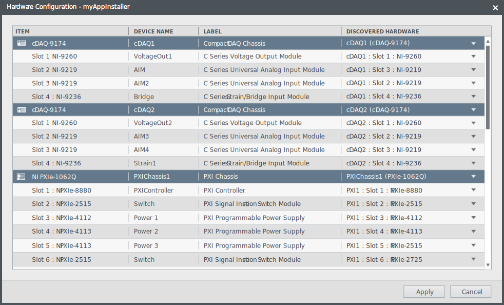
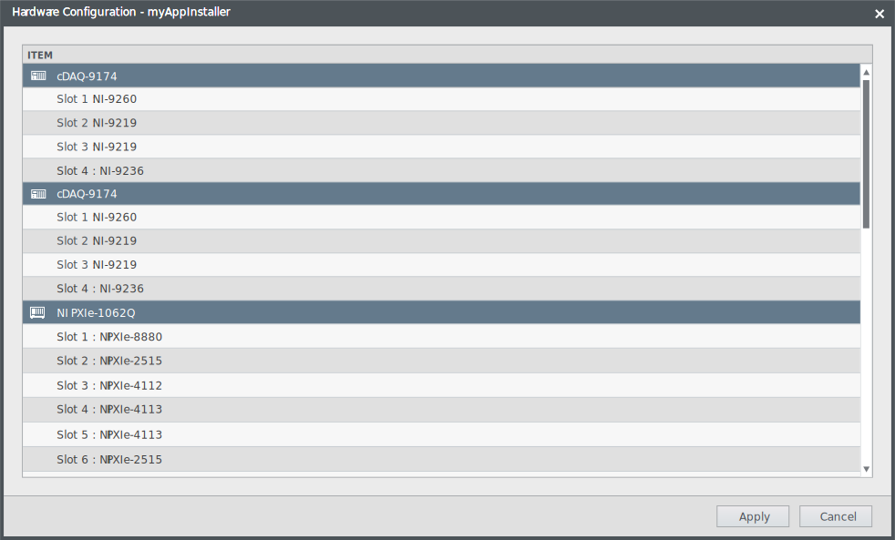
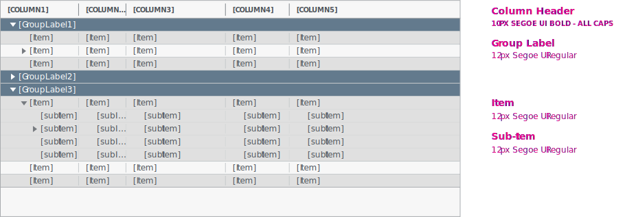
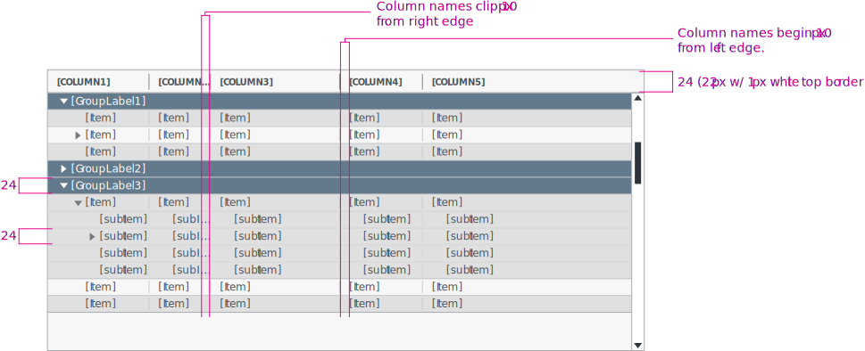
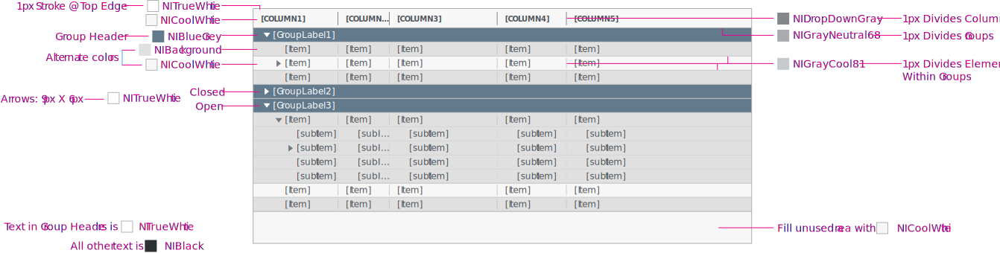
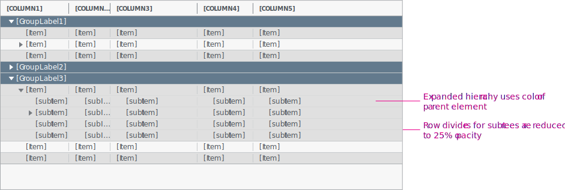

**Codename:** `ShellTable` - NationalInstruments.Controls.Shell 

A table control allows the user to scan, compare, and take action on information. 

## General usage
When the user wants to browse lots of information at once.

When the user wants to determine and execute actions efficiently.

When the user wants to compare information.

## Is there an alternative control to consider using?

An alternative control to consider using is a list box or the Scalable Configuration Table (SCT).

If there is only one column of information to display, use a list box.

If your users needs a table with the ability to select rows, sort, filter, or edit cells in place, use the SCT.

## Usage examples

Example of a table providing scanability with a control in the row.

  

Do

Do not use a table if you only need to display one column of information.

  

Don't

## Visual Design

#### Typograpghy

  

#### Spacing

  

#### Color

  

#### Sub-item Grouping

  