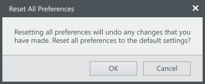

Text blocks are used for to describe controls in the UI. They are used for labels and other read-only text for the IDE. If the user needs to be able to edit the text, consider using a [text box](../text-boxes/).

**Codename:** `ShellTextBlock` - NationalInstruments.Controls.Shell

## Control labels
In this example, the  is being used to provide a label for a control.

## Description text
In this example, the text block is being used to provide static information to the user.

**XAML code snippet**

<shell:ShellTextBlock Text="Text block" />

