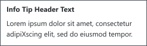
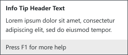
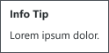

Tooltips and infotips, collectively called tips, are used to provide additional context to a UI element.

- Use tooltips on truncated text to provide the full name. It isn't necessary to provide a tip to text that is not truncated.

## General usage
- Use tips to provide the command name of a control which doesn't contain text in the element, itself.
- If the element has a shortcut, provide the shortcut in the tip.

#### Choosing between a tooltip and an infotip
- Tooltips provide a concise label to help identify a UI element. If the user only needs to understand what a command is, use a tooltip. 
- Infotips are used to provide addtional context to an item when helpful. If a command is seldom used or complex, an infotip can provide more information than a tooltip. 
- If the extra information provided by an infotip would be redundant to the command, use a tooltip.
- If you need to provide the name **and** description of an element, use an infotip.
- Don't rely solely on consistency. Just because other elements are using an tooltip or tooltip it isn't required that your tip use the same implementation. The part to keep consistent is providing the appropriate amount of information for the user.  

## Tooltips
Tooltips provide name or basic description of an element. 

## Infotips
- Do not include elements in an infotip that require the user to click.
- Due to their extra content, infotips do not timeout so the user has time to read the information.
  - Techically, it is not possible to turn off the timout value. However, you can set the `ShowDuration` propoerty to a very large value, like 360000000, to achieve this effect.

#### Example
**Basic**  

**Including an optional footer**  
  

