Tooltips and infotips, collectively called tips, are used to provide additional context to a UI element.

## General usage
Use tips to provide the name of a control which doesn't contain text in the element, itself. For example, a control that only has an icon in it.  
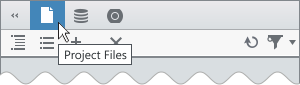

If the element has a shortcut, provide the shortcut in the tip.

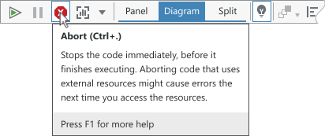  

Do

It isn’t necessary to provide a tip for every control. Consider how useful a tip is for helping the user understand a command.

  

Don't

## Placement
Place tips in an area that avoids covering related content.  

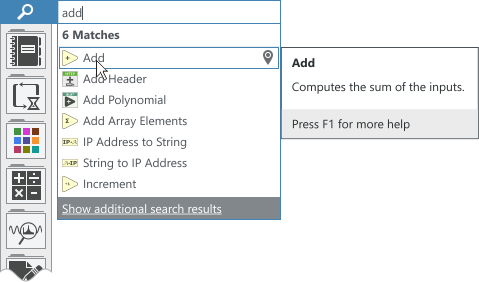  

Do

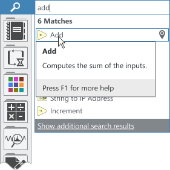  

Don't

## Choosing between a tooltip and an infotip
- Tooltips provide a concise label to help identify a UI element. If the user only needs to understand what a command is, use a tooltip.
- Infotips are used to provide additional context to an item when helpful. If a command is seldom used or complex, an infotip can provide more information than a tooltip. 

If the extra information provided by an infotip would be redundant, use a tooltip instead.

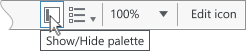  

Do

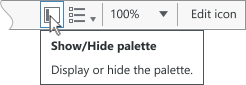  

Don't

In the example above, the extra content is redundant and unnecessary. A tooltip can be used to define what the control does.

If you need to provide the name **and** description of an element, use an infotip.
  
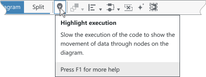

Don't rely solely on what other controls are using. Just because other elements are using an tooltip or infotip it isn't required that your tip use the same implementation. The part to keep consistent is providing the appropriate amount of information for the user.

## Tooltips
Tooltips provide name or the basic description of an element. 

  

For truncated text, use tooltips to provide the full name.  

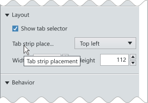  

Do

If a textblock is not truncated, don't provide a tooltip if it just repeats the text.  

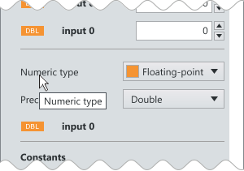  

Don't

If the tooltip is providing additional information about an element, it is OK to show it even if the text is not truncated.  

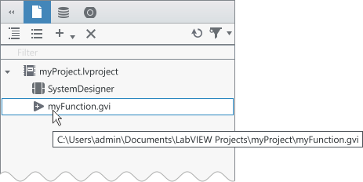  

Do

### Layout and spacing
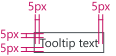  

## Infotips
Do not include elements in an infotip that require the user to click. However, you can provide commands via key input to execute commands in the footer.

Due to their extra content, infotips do not timeout so the user has time to read the information.
  - Technically, it is not possible to turn off the timout value. However, you can set the `ShowDuration` property to a very large value, like `360000000`, to achieve this effect.

It isn't necessary to use a header in an infotip if it is simply repeating the text in the element. 

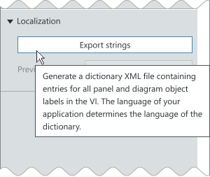  

Do

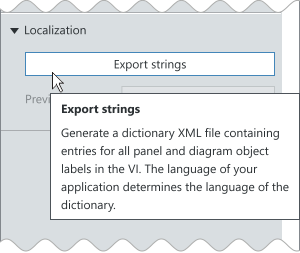  

Don't

**Exception:** In the palette we have chosen to always show the header in the infotip since the items are a closely related collection and the header sometimes varies from the name shown in the palette.

### Layout and spacing
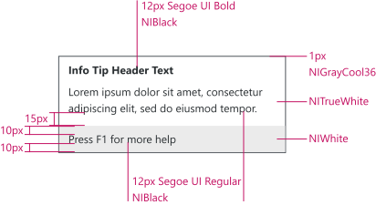     
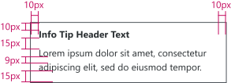  
