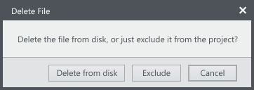
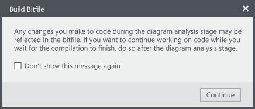
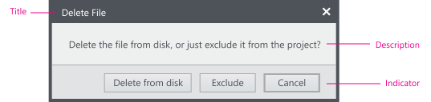

A confirmation is presented when the user is taking an action that may be significant or irreversible to ensure the user understands that action and result before it executes.

The confirmation may also provide additional information about the action to help educate and inform the user about the functionality.

Typically, a modal dialog is used to ask for confirmation from a user.

## Confirmation for safety  
Confirmations are useful to help the user avoid performing operations that can’t be undone.    

## Confirmation for education
Confirmations can be used to help the user understand more information before performing a complex operation. These should be used sparingly as there may be a better solution to achieve this goal.  
In these cases, you can use “Do not show this again” so that the user doesn’t have to continually see this message once they understand the operation.  

## Confirmation dialogs

**Title**  
For the title of a confirmation dialog, reiterate the command that needs confirmation adding light context if needed. Do not use the title to ask a question or explain the operation; that is the purpose of the dialog description.

**Description**  
Use the description area of the dialog to provide more context or put the operation into a more user understandable phrasing.

**Commit buttons**  
For information on commit buttons in dialogs, see [Dialogs](../../elements/dialogs/).

**Layout**  
For information on dialog layout, see [Dialogs](../../elements/dialogs).