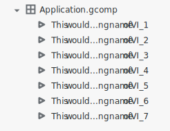
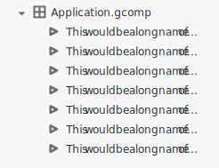

Ellipses should be used when shortening text that cannot fit in a specific space. For example, if a filename name is longer than the space available in the Project Files pane, truncate it and use an ellipsis to signify its truncation. There are three techniques (middle, front, end) for shortening text with an ellipsis:

## Middle truncation
 When the end of the text is important or distinctive, truncate the text in the middle and replace the truncated text with an ellipsis.

If you're unsure, it's best to use middle truncation, as it keeps both the beginning and end of the string intact

## Other cases

If the important or distinctive text is at the beginning of the string, truncate at the end.

If all of the beginning text of items in a list is the same, but the important or distinctive text is always at the end of the string, truncate it at the beginning.

## Special cases
When the entire file extension must be shown, still consider the 3 guidelines above in relation to the string before the file extension. Apply the guidelines as best as you see fit.  If delimiters are in the string, always truncate between the delimiters and eat the entire identifier before truncating a delimiter and moving into the next identifier, this prevents creating the appearance of false or misleading namespaces.

#### Examples

End truncation with file extension: File_na….gcomp

Middle truncation with file extension: Fil…ame.gcomp

**Note:** Be sure to use the ellipsis character and not three consecutive periods. 
Unicode Encoding: C/C++/Java source code `\u2026`

#### Usage examples

Middle truncation increases the likelihood the differentiating character is visible to the user.

  

Do

In this example, end truncation hides the unique identifying character in this example of the files pane.

 

  

Don't

Truncating long strings with delimiters

When using middle truncation on strings with delimiters, truncate between the delimiters to minimize the appearance of non-existent namespaces.

  
 
Do

Hiding the delimiters before all of the characters of an identifier can create confusion.

   

Don't

