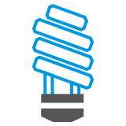
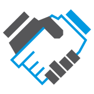
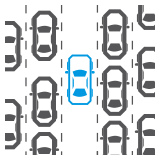

  
  <h2>Efficient</h2>
  
  
Let users do their thing with efficiency (get out of the way)

  
  

    allow direct manipulation for common actions 
    provide a means to apply settings across multiple objects (batch operations) 
    different stages of the workflow may call for different levels of “scrappiness” 
    be cautious when making assumptions about what users want 
  

  

 
  
  <h2>Modern</h2>
  
  
Modernize without losing the goodness of what came before

  

    use common, familiar interaction and visual patterns   
    strive for migration of functionality, not parity of interactions   
    balance between familiarity and innovation 
  

  
  <h2>Learnable</h2>  
  
Help users create a foundation of knowledge that can be built upon

  

    guide users to understanding without distracting them from their goal   
    encourage and allow exploration with minimal consequences   
    maintain consistent interaction and visual patterns between basic and advanced workflows   
    use progressive disclosure to promote good decision-making and reduce cognitive load 
  

 
  
  <h2>Trustworthy</h2>  
  
Work as a trusted partner to inspire confidence

  

    complexity isn’t always bad; don’t strictly strive for simplicity   
    give appropriate feedback and actionable error messaging to inform users of the system’s status   
    encourage and allow exploration with minimal consequences 
  

  
  <h2>Unobtrusive</h2>
  
Allow users to focus on creating meaningful content

  

    user content should be clear and readable 
    avoid obscuring the workspace 
    reduce the need to focus on chrome or pixel pushing 
  

