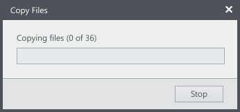

**Codename:** `ShellProgressBar` - NationalInstruments.Controls.Shell  
**Codename:** `BusyDialog` – NationalInstruments.Shell

Progress indicators are used to visually inform the user about an ongoing operation. They let the user know that the app isn’t stalled or frozen.

## General Usage 
Two types of progress indicators are provided. The first is a progress bar that can be used to show determinate or indeterminate progress. There is also a round progress indicator that can be used to show indeterminate progress.

**Progress bar**  

**Round progress indicator**  
  
**Note:** The round progress indicator is currently a part of the `BusyDialog`.

## Alternatives
If the operation is very quick (1/2 to 2 seconds) consider using the wait cursor provided by the operating system. If the user is more interested in each step of the operation, consider listing out each step of the operations in a list view.

## Determinate vs. Indeterminate progress
#### Determinate progress indicators  
Determinate progress indicators show an approximate percentage of completion.

Use determinate progress indicators for an operation with a known duration (even if you can’t accurately predict the time). Update the progress every 2-5 seconds but don’t advance the progress bar if no progress is actually happening.

Show total progress and not progress of the current step.

  

Do

  

Don't

Start at 1% rather than 0%. Users worry if a progress bar stays at 0% for more than a couple of seconds.

  

Do

  

Don't

  

#### Indeterminate progress indicators    
Indeterminate progress indicators show an operation is ongoing.

Use when there is no notion of completeness such as when operations require an unbounded amount of time or operations access an unknown number of objects.

Don’t include percent complete or time remaining estimates. If you can provide this information, use a determinate progress bar.

### Going from indeterminate to determinate

If an operation gets to a point where overall progress can be determined, switch to a determinate progress indicator.

As an example, copying a large number of files may requires an initial, indeterminate, stage the files are being collected and counted. Once that is complete, we can provide the user with a determinate progress indicator to show the progress of how many files have been copied.

 

Deciding which progress indicator to use

| Seconds          | Progress indicator              |
| ---------------- | ------------------------------- |
| Less than 1/2    | None needed                     |
| 1/2 to 2         | Busy cursor                     |
| 2 to 5           | Progress bar                    |
| More than 5      | Progress bar with progress units|
| More than 10     | Progress bar with progress units and with a way to cancel or stop|

## Cancelling an in-progress operation

If an operation can last more than 10 seconds, provide a way for a user to exit the operation.

Depending on what state exiting the operation will leave the user in, use Cancel or Stop as the button to for exiting the operation

| Button label     | Action              |
| ---------------- |---------------------|
| Cancel           | Returns environment to the previous state (i.e. no side effects).        |
| Stop             | Leaves partially completed operation intact.         |

It’s OK to change button text from Cancel to Stop in the middle of an operation.

## Providing supporting information with progress

#### Quantitative vs. Quantitative information  

Quantitative information has a numeric value in time or work units, such as “About 30 minutes remaining” or “Downloaded 3 MB of 12 MB”.

Use quantitative data when:  
* Users need objective data to analyze failure, performance, or other diagnostics.
* Provides assurance that work units have successfully completed.

Qualitative is typically used for showing state/phase, such as “Securing remote connection”. Useful when actual work units are not valuable to the user. It is also great for summarizing work completed.

Use qualitative data when:  
* Quantitative data isn’t valuable to the user.
* Users will benefit from reading a simple description of work done.
* Mid-progress needs to call something to the user’s attention.

## Layout

