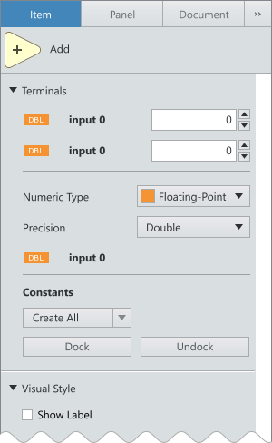

This section provides guidelines for capitalizing text in the UI of NI software products that run on Microsoft Windows. These guidelines apply to text objects throughout the UI of NI software, such as button labels, window titles, tooltips, checkboxes, etc. These guidelines do **not** apply to node or terminal names.

## Guidelines

Use title-style capitalization for window titles; sentence-style capitalization for all other UI elements. While there are some exceptions (noted below), these guidelines can be used to address most of the text in the UI.

## Examples

### Dialog
Outside of the title of the dialog, itself, all items should be sentence-style capitalization.

 

### Context menu
All items in the context menu should follow sentence-style
capitalization.  

  

Do

  

Don't

### Configuration pane
All items in the configuration pane should follow sentence-style
capitalization.

  

Do

  

Don't

## Exceptions

1. Use title capitalization for tabs in panes throughout the IDE. For example, the tabs in the navigation pane (on the left), configuration pane (on the right) or the tools pane (along the bottom) along the bottom rail of LabVIEW.
* Also use the same capitalization when referencing those panes such as in the tools pane for the left rail and the application menu.
1. When referencing a node/palette category name (or anything in the palette, really) follow the capitalization of the item being referenced.
* Ex: If you are talking about the “Add” node, use Add. If you are talking about adding things, use add.
1. When referencing a terminal name, follow the capitalization of that terminal.
1. When referencing a Dialog Title, follow the capitalization of that dialog (Title case).
* For example, referencing "Context Help" in the application menu (Help > Context Help) should use Title Case as it is the name of the dialog.
1.File types are proper nouns and should be Title Case (Web VI, Resource Collection, Shared Library Interface, etc.)